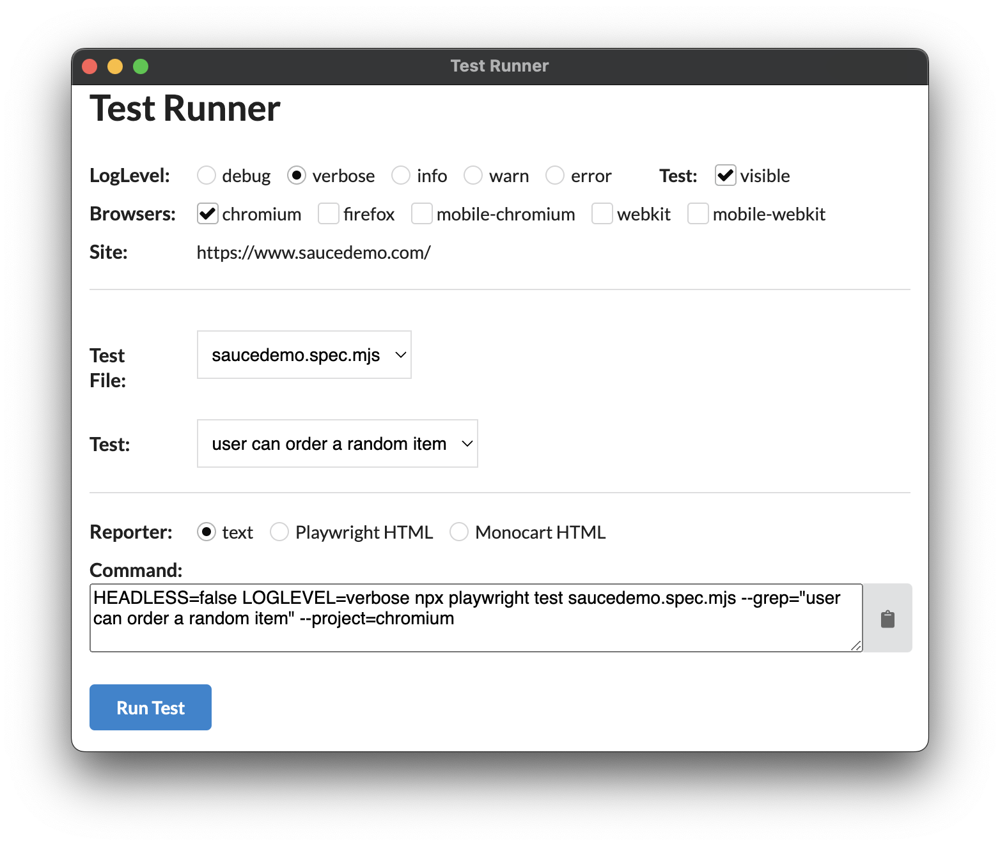

# saucedemo-playwright repository

This repository contains UI automated tests for validating the functionality of the [SauceDemo](https://www.saucedemo.com) example website. It is built using [Node.js](https://nodejs.org/en) and [Playwright](https://playwright.dev/) test automation framework.

This repository was built using [Page Object Model](https://playwright.dev/docs/pom) class files where each object represents a separate page of a website. You can find these in the `/pages` subdirectory of the repository.

Since many pages have shared, common functionality between them (such as the MiniCart functionality in the header), the page objects are created using a base class and several component "method" files. The methods in these method files are then assigned to each page object (i.e. an aggregate object). This keeps common functionality in sepearate, individual files where they can be updated in one location, but then all page objects will receive the updated functionality.

Additionally, an `AllPages` object acts as a Page Factory for creating page objects for all pages of the website. This is created at the beginning of each test.

Test files can be found in the `/tests` subdirectory. They have a filename format like `testname.spec.mjs`.

---

## Repository installation instructions:

1. Clone the repository
2. Run `npm install`

---

## Environment Variables:

Environment variables can be set on your system or within the `config/.env` file. This file is a good place to try other values in the tests.

---

## Usage:

### via GUI:



The easiest way to run a test is via the GUI: `npm run gui`  
This provides a UI app that lets you try different tests and options.  
Note: the GUI lets you

- run the test directly via the "Run Test" button, or
- you can copy the command at the bottom of that app and then paste and run that command from a terminal window

### via command-line:

Additionally, commands can be run directly from the terminal. (Look for the commands in the comment above each test.)

**Examples:**

```
LOGLEVEL=verbose npx playwright test saucedemo.spec.mjs --grep="user can login to website" --project=chromium
LOGLEVEL=verbose npx playwright test saucedemo.spec.mjs --grep="user can order a random item" --project=firefox
LOGLEVEL=verbose npx playwright test saucedemo.spec.mjs --project=mobile-webkit
```

### LogLevel:

The repository uses [Winston logger](https://github.com/winstonjs/winston) to support logging with configurable log levels. Log levels include:

- debug
- verbose
- info
- warn
- error

In the GUI, choose the logging level you prefer. Standard output logging will then include that level of logging plus all other high severity logging levels.

So for example, if you choose "info" loglevel, you will then see "info", "warn", and "error" log messages.

This is then a way to increase or decrease the verbosity of the standard output log messages you see.

### Browsers:

Browsers can be chosen with the "--project" option. Options include:

- chromium
- firefox
- webkit (i.e. Safari)
- mobile-chromium (i.e. Pixel 7)
- mobile-webkit (i.e. iPhone 15)

Multiple browsers can be selected to run multiple tests in parallel.

### Reporters:

This respository supports reporting to three different types of reports:

- text
- Playwright's HTML report
- MonoCart's HTML report

In the GUI, select the reporter radio button and note the `--reporter=` additions in the Command box.
